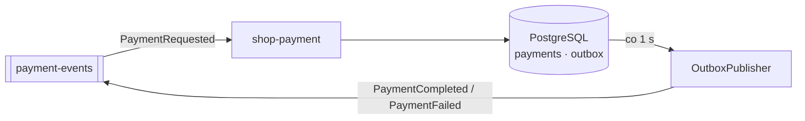

# shop-payment

Mock PSP (Payment Service Provider) — mikrousługa przetwarzająca płatności w architekturze event-driven.  
Stack: **Java 25 · Spring Boot 4.0.7 · Kafka · PostgreSQL · Flyway · Gradle 9.6**

## Jak działa

Nasłuchuje na topiku `payment-events` zdarzeń `PaymentRequested`, symuluje rozliczenie i publikuje wynik z powrotem na ten sam topik.

- **15% losowych odrzuceń** (konfigurowalne przez `PAYMENT_FAILURE_RATE`)
- **Deterministyczny hook dla testów:** kwota kończąca się na `.66` jest zawsze odrzucona
- **Idempotentne po `orderId`:** to samo zamówienie nie zostanie obciążone dwa razy
- **Outbox pattern:** wynik trafia najpierw do tabeli `outbox` w jednej transakcji z DB, a scheduler publikuje go do Kafka co 1 s



## Konfiguracja (env vars)

| Zmienna | Domyślna | Opis |
|---|---|---|
| `SPRING_DATASOURCE_URL` | — | JDBC URL do PostgreSQL |
| `SPRING_KAFKA_BOOTSTRAP_SERVERS` | — | Adres brokera Kafka |
| `SPRING_KAFKA_CONSUMER_GROUP_ID` | `shop-payment` | Kafka consumer group |
| `PAYMENT_FAILURE_RATE` | `0.15` | Odsetek losowych odrzuceń (0.0–1.0) |
| `PAYMENT_LATENCY_MS` | `200` | Sztuczne opóźnienie symulujące PSP (ms) |

## Build & run

```bash
# testy (Cucumber BDD + Testcontainers — nie wymaga zewnętrznych usług)
./gradlew test

# jar
./gradlew bootJar

# obraz Docker
docker build -t shop-payment .
```

Aplikacja nasłuchuje na porcie **8080**. Health check: `GET /actuator/health`.

## CI

Każdy PR uruchamia preprod gate (`ai-bot-playground/shop-acceptance-tests`): buduje obraz, stawia usługę na klastrze `kind-preprod` i odpala testy cross-service. Wymagany zielony status `preprod-gate / gate` przed mergem.
