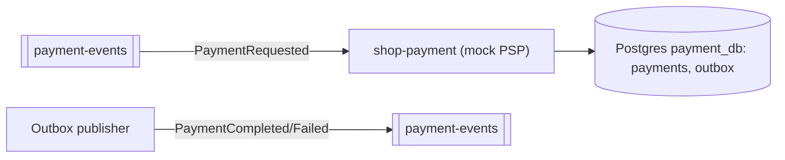
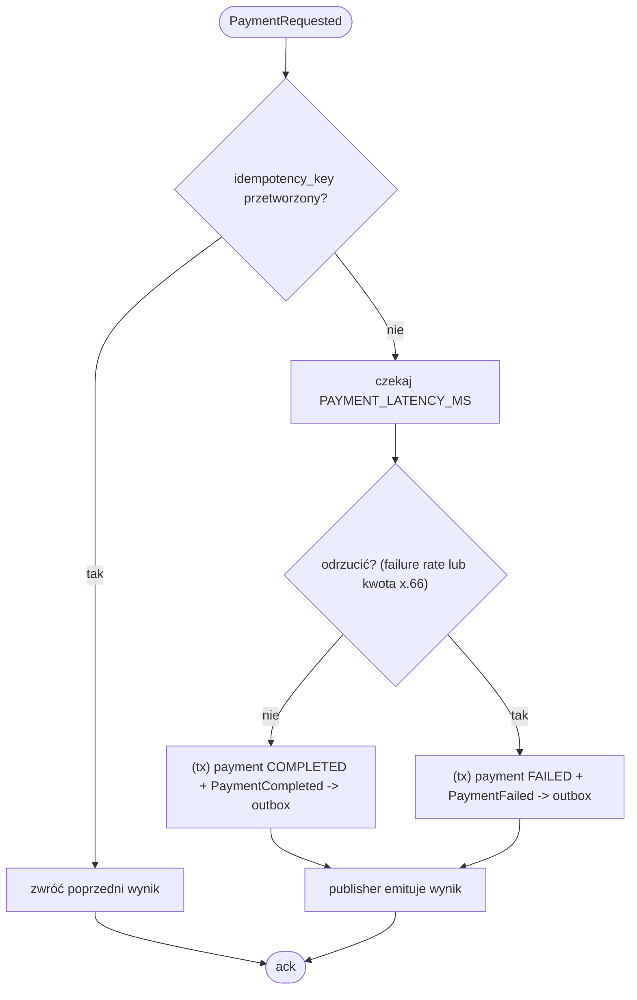

# shop-payment

Przetwarza płatności. W demie to **mock** z konfigurowalnym odsetkiem odrzuceń —
dzięki temu łatwo wywołać ścieżkę kompensacji. Interfejs jak do prawdziwego
operatora (Stripe, PayU), żeby podmiana była łatwa. Standalone repo z własnym
`Dockerfile` i kodem. Stack: Spring Boot + JPA (Postgres) + Spring Kafka.

## Zdarzenia Kafki

Konsumuje (grupa `shop-payment`): `PaymentRequested` (z `payment-events`).
Publikuje (`payment-events`, klucz `orderId`): `PaymentCompleted` / `PaymentFailed`.

## Logika (do zaimplementowania)

1. Odbierz `PaymentRequested`, sprawdź idempotencję po `idempotency_key`/`orderId`
   (ta sama płatność **nie może** obciążyć klienta dwa razy przy retry).
2. Zasymuluj rozliczenie: opóźnienie `PAYMENT_LATENCY_MS`, wynik losowany wg
   `PAYMENT_FAILURE_RATE` (np. 0.15 = 15% odrzuceń).
3. Zapis wyniku w `payments` + zdarzenie do `outbox` (jedna transakcja).
4. Publisher wysyła `PaymentCompleted` / `PaymentFailed`.

## Idempotencja
`payments(order_id / idempotency_key UNIQUE, status, amount)`. Płatność dla
istniejącego klucza → zwróć poprzedni wynik, nie przetwarzaj ponownie.

## Refund (na przyszłość)
Gdy w przepływie pojawi się krok po płatności, który może się nie powieść,
shop-payment musi umieć wykonać **zwrot** jako własną akcję kompensującą.

## Podmiana na realnego operatora
Zastąp mock klientem PSP. Uwaga na webhooki (operator potwierdza asynchronicznie) —
wtedy `PaymentCompleted` emitujesz dopiero po webhooku.

## Konfiguracja (env)
`SPRING_DATASOURCE_URL=.../payment_db`, `SPRING_KAFKA_BOOTSTRAP_SERVERS=shop-kafka:9092`,
`SPRING_KAFKA_CONSUMER_GROUP_ID=shop-payment`, `PAYMENT_FAILURE_RATE=0.15`,
`PAYMENT_LATENCY_MS=200`.

## High Level Design (ogólny workflow)

Mock PSP sterowany zdarzeniami: konsumuje `PaymentRequested`, symuluje rozliczenie
(opóźnienie + wynik wg `PAYMENT_FAILURE_RATE`, plus deterministyczny hook: kwota
`x.66` zawsze odrzucona), zapisuje wynik + zdarzenie do outboxa, publisher wypycha
`PaymentCompleted/Failed`. Idempotentne po `idempotency_key`/`orderId`.

## Low Level Design (diagram aktywności)

